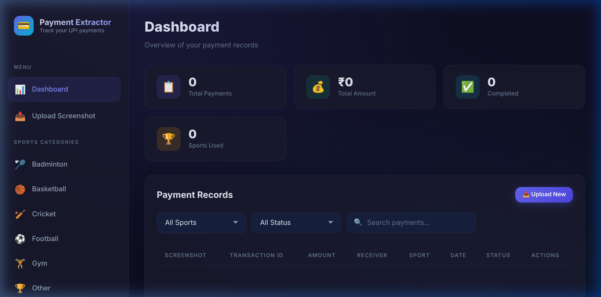
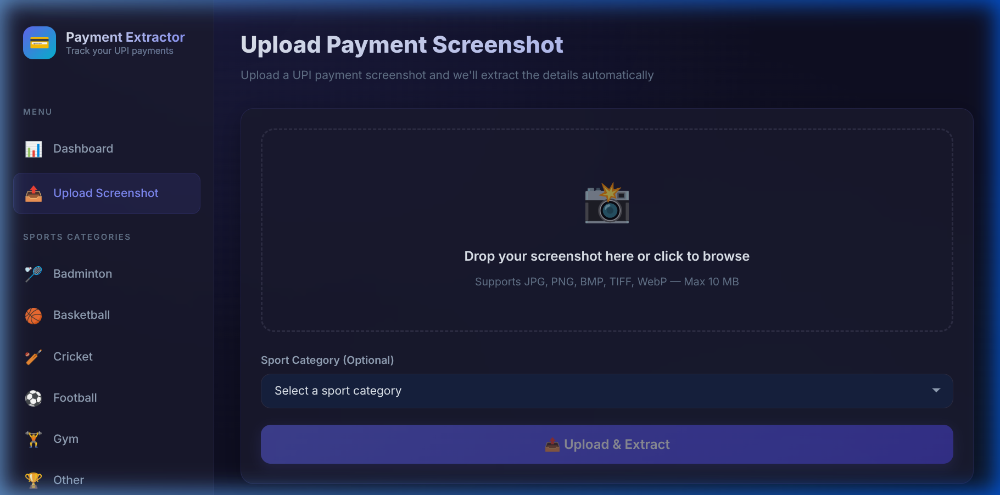

# 💳 Payment Details Extractor

A full-stack web application that allows users to upload UPI payment screenshots, automatically extract payment details using OCR (Optical Character Recognition), and track payments across multiple sports categories.

---

## 🎯 Project Overview

- **Upload** UPI payment screenshots (JPG, PNG, etc.)
- **OCR** automatically extracts: Amount, Transaction ID, UPI ID, Sender/Receiver, Date, Status
- **Dashboard** with stats, filters, and search across all payments
- **Multi-Sport** support — categorize payments by Cricket, Football, Badminton, and more
- **JWT Authentication** — secure user accounts
- **Responsive** — works on desktop and mobile

---

## 🧱 Tech Stack

| Layer | Technology |
|-------|-----------|
| **Backend** | Python FastAPI |
| **Database** | SQLite via SQLAlchemy ORM |
| **OCR Engine** | Tesseract (pytesseract) |
| **Authentication** | JWT (python-jose + passlib) |
| **Frontend** | Vanilla HTML + CSS + JavaScript |
| **Containerization** | Docker + Docker Compose |

---

## 📁 Project Structure

```
├── backend/
│   ├── main.py              # FastAPI entry point
│   ├── config.py             # Configuration settings
│   ├── database.py           # SQLAlchemy setup
│   ├── models.py             # DB models (User, Payment, Sport)
│   ├── schemas.py            # Pydantic schemas
│   ├── auth.py               # JWT authentication
│   ├── ocr_service.py        # Tesseract OCR logic
│   ├── routes/
│   │   ├── auth_routes.py    # Register, Login, Profile
│   │   ├── payment_routes.py # Upload, CRUD payments
│   │   └── sport_routes.py   # Sports categories
│   ├── uploads/              # Stored screenshots
│   └── requirements.txt
├── frontend/
│   ├── index.html            # Login / Register
│   ├── dashboard.html        # Payment dashboard
│   ├── upload.html           # Upload screenshot
│   ├── css/style.css         # Global styles
│   └── js/
│       ├── api.js            # API client
│       ├── auth.js           # Auth page logic
│       ├── dashboard.js      # Dashboard logic
│       └── upload.js         # Upload logic
├── Dockerfile
├── docker-compose.yml
└── README.md
```

---

## 🗄️ Database Schema

### Users
| Column | Type | Description |
|--------|------|-------------|
| id | INTEGER (PK) | Auto-increment |
| username | VARCHAR(50) | Unique username |
| email | VARCHAR(100) | Unique email |
| password_hash | VARCHAR(255) | Bcrypt hash |
| created_at | DATETIME | Account creation timestamp |

### Sports
| Column | Type | Description |
|--------|------|-------------|
| id | INTEGER (PK) | Auto-increment |
| name | VARCHAR(50) | Sport name (e.g., Cricket) |
| icon | VARCHAR(10) | Emoji icon |
| description | VARCHAR(200) | Short description |
| created_at | DATETIME | Creation timestamp |

### Payments
| Column | Type | Description |
|--------|------|-------------|
| id | INTEGER (PK) | Auto-increment |
| user_id | INTEGER (FK → users) | Owner |
| sport_id | INTEGER (FK → sports) | Category (optional) |
| transaction_id | VARCHAR(100) | Extracted transaction ID |
| amount | FLOAT | Extracted amount |
| sender_name | VARCHAR(100) | Extracted sender |
| receiver_name | VARCHAR(100) | Extracted receiver |
| date | VARCHAR(50) | Extracted date |
| status | VARCHAR(20) | Payment status |
| upi_id | VARCHAR(100) | Extracted UPI ID |
| screenshot_path | VARCHAR(255) | Filename of stored image |
| raw_ocr_text | TEXT | Full OCR output |
| created_at | DATETIME | Record creation timestamp |

---

## 📡 API Documentation

Base URL: `http://localhost:8000`

Interactive API docs (Swagger): **http://localhost:8000/docs**

### Authentication

| Method | Endpoint | Description | Auth |
|--------|----------|-------------|------|
| POST | `/api/auth/register` | Create new account | ❌ |
| POST | `/api/auth/login` | Login, returns JWT | ❌ |
| GET | `/api/auth/me` | Get current user | ✅ |

### Payments

| Method | Endpoint | Description | Auth |
|--------|----------|-------------|------|
| POST | `/api/payments/upload` | Upload screenshot + OCR | ✅ |
| GET | `/api/payments` | List payments (filterable) | ✅ |
| GET | `/api/payments/{id}` | Get payment detail | ✅ |
| PUT | `/api/payments/{id}` | Update payment fields | ✅ |
| DELETE | `/api/payments/{id}` | Delete payment | ✅ |

**Query Parameters for GET /api/payments:**
- `sport_id` — Filter by sport category
- `status` — Filter by status (success, pending, failed)
- `search` — Search by transaction ID, names, or UPI ID

### Sports

| Method | Endpoint | Description | Auth |
|--------|----------|-------------|------|
| GET | `/api/sports` | List all sports | ❌ |
| POST | `/api/sports` | Create a sport | ❌ |
| DELETE | `/api/sports/{id}` | Delete a sport | ❌ |

---

## 🚀 Steps to Run

### Prerequisites

- Python 3.9+
- Tesseract OCR installed (`sudo apt install tesseract-ocr`)
- Node.js is **NOT** required (vanilla frontend)

### Backend

```bash
# 1. Install dependencies
cd backend
pip install -r requirements.txt

# 2. Start the server
uvicorn main:app --reload --port 8000
```

The API will be available at **http://localhost:8000**
Swagger docs at **http://localhost:8000/docs**

### Frontend

```bash
# Open in browser (uses a simple HTTP server)
cd frontend
python -m http.server 5500
```

Open **http://localhost:5500** in your browser.

### Docker (Optional)

```bash
# Build and run
docker-compose up --build

# Access at http://localhost:8000
```

---

## ✨ Features

- 🔐 **JWT Authentication** — Secure login and registration
- 📸 **Screenshot Upload** — Drag-and-drop with preview
- 🔍 **OCR Extraction** — Automatic payment detail parsing
- 📊 **Dashboard** — Stats cards, payment table, filters
- 🏆 **Sports Categories** — Categorize payments by sport
- 🔎 **Search & Filter** — By sport, status, or text search
- 📱 **Mobile Responsive** — Works on phones and tablets
- 🐳 **Docker Support** — One-command deployment

---

## 🖼️ Screenshots

### 1. Dashboard Overview

*The main dashboard showcasing tracked payments, stats, and filters.*

### 2. Upload & Extract

*Modern drag-and-drop interface with sport category selection and real-time OCR feedback.*

---

## 📜 License

This project is built as an assignment deliverable.
